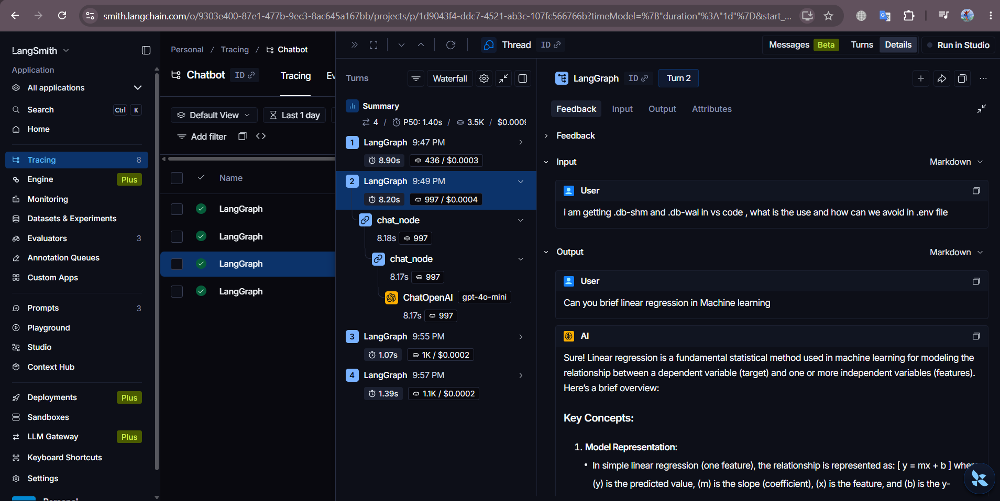
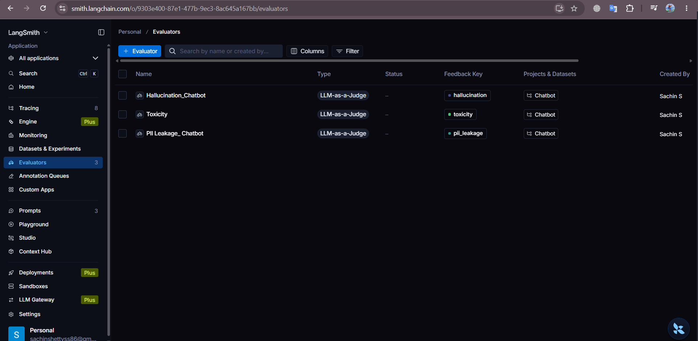
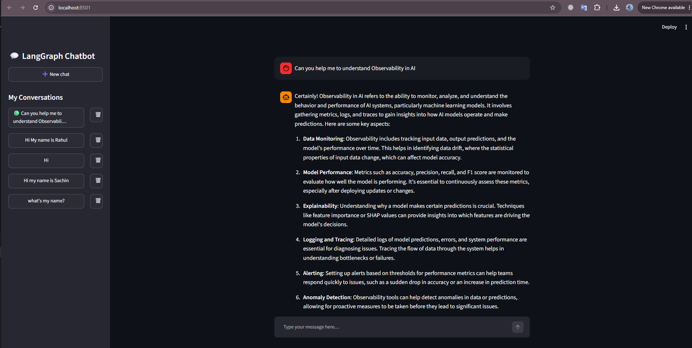

LangGraph Chatbot with LangSmith Observability & Evaluation

A persistent, streaming chatbot built with LangGraph, LangChain, and Streamlit, backed by SQLite for conversation history and enhanced with LangSmith for LLM tracing, observability, and evaluation.

Live Demo: https://project3llmchatbot-5gzuszatcnmvhuv6ftx3qn.streamlit.app/

🚀 Overview

This project started as a persistent conversational chatbot using LangGraph + LangChain + Streamlit + SQLite.

The latest version adds LangSmith integration to make the application more observable and measurable. LangSmith is used to trace LangGraph executions, inspect LLM calls, monitor conversations, and evaluate chatbot responses using custom evaluators.

This makes the project demonstrate not only how to build and deploy a LangGraph chatbot, but also how to monitor and evaluate an LLM application in practice.

✨ Features
Chatbot
🔄 Streaming responses — tokens appear live as the model generates them
💾 Persistent conversations — conversations are checkpointed to SQLite using LangGraph's SqliteSaver
🗂️ Multi-conversation sidebar — switch between previous conversations
🏷️ Automatic conversation titles — threads are labeled using the first user message instead of a raw UUID
🗑️ Delete conversations — remove a thread and its conversation history
⚙️ Environment-based configuration — configure the model, temperature, system prompt, database path, and API keys without modifying the source code
🛡️ Error handling — API and application errors are displayed cleanly in the Streamlit UI
🔍 LangSmith Observability

The enhanced version integrates LangSmith to provide:

🔎 LLM tracing — trace LangGraph executions and individual model calls
🌳 Run-level visibility — inspect the execution flow of chatbot requests
🤖 LLM call inspection — view prompts, responses, latency, and execution details
📊 Application observability — monitor chatbot behavior through LangSmith
🧪 Evaluation support — evaluate chatbot responses using custom evaluators
📈 Debugging and analysis — identify issues in prompts, model responses, and application flow
🆕 LangSmith Enhancement

The latest implementation introduces LangSmith into the chatbot architecture.

Previous Architecture
User
 │
 ▼
Streamlit Frontend
 │
 ▼
LangGraph StateGraph
 │
 ▼
Chat Node
 │
 ▼
ChatOpenAI
 │
 ▼
SQLite Checkpointer
🆕 Enhanced Architecture
The latest version integrates LangSmith with the LangGraph chatbot to provide tracing, observability, and evaluation.

flowchart TD
    A["🖥️ Streamlit UI Chatbot Frontend"]
    B["🔄 LangGraph StateGraph"]
    C["💬 Chat Node"]
    D["🤖 ChatOpenAI"]
    E["💾 SQLite Checkpointer"]
    F["🔍 LangSmith Observability + Evaluation"]

    A --> B
    B --> C
    C --> D
    B --> E
    B -. "Traces" .-> F
    D -. "LLM Traces" .-> F

LangSmith provides visibility into the execution of the LangGraph application without changing the core conversational workflow.

📁 Project Structure

The project contains both the original implementation and the LangSmith-enhanced implementation:

.
├── MainChatobot\Chatbot_Langgraph_Backend.py
├── MainChatobot\Chatbot_Streamlit_Frontend.py
│
├── Chatbot_Langgraph_Backend_withLangsmith.py
├── Chatbot_Langgraph_Frontend_Langsmith.py
│
├── Langsmith_Evaluators.png
├── Langsmith_tracing_Screenshot.png
│
├── requirements.txt
├── .env.example
└── README.md

Original Implementation
MainChatobot\Chatbot_Langgraph_Backend.py
MainChatobot\Chatbot_Streamlit_Frontend.py

The original implementation provides the core chatbot functionality including LangGraph orchestration, streaming responses, SQLite persistence, and the Streamlit interface.

LangSmith-Enhanced Implementation
Chatbot_Langgraph_Backend_withLangsmith.py
Chatbot_Langgraph_Frontend_Langsmith.py

The enhanced implementation adds LangSmith tracing and evaluation capabilities while retaining the original chatbot functionality.

🔬 LangSmith Tracing

Each chatbot interaction can be traced through LangSmith, allowing you to inspect the execution of the application.

The traces can be used to understand:

Which LangGraph nodes were executed
Input and output messages
LLM prompts and responses
Execution latency
Run hierarchy
Model behavior
Errors and failures
LangSmith Tracing Screenshot

  

The tracing view provides a detailed look into how an individual chatbot request flows through the LangGraph application and the underlying LLM calls.

🧪 LangSmith Evaluators

The enhanced project also includes LangSmith evaluators to assess chatbot responses.

Evaluators can be used to measure the quality and behavior of generated responses rather than relying solely on manual inspection.

The evaluation workflow provides a foundation for measuring aspects such as:

Response quality
Relevance
Correctness
Consistency
Overall chatbot performance
LangSmith Evaluators Screenshot

  

This allows the chatbot to move beyond simply generating responses toward having a repeatable process for observing and evaluating LLM output.

🖼️ Chatbot UI

The Streamlit frontend provides a simple conversational interface with:

Streaming responses
Conversation history
Multiple conversation threads
Automatically generated conversation titles
Conversation deletion
Persistent state across application restarts

  

🏗️ Architecture

The backend uses a LangGraph StateGraph containing the chatbot logic and SQLite-based checkpointing.

The frontend communicates with the compiled graph and helper functions exposed by the backend.

The main responsibilities are separated as follows:

Backend
Chatbot_Langgraph_Backend.py

Responsible for:

LangGraph StateGraph
Chat node
LangChain model integration
SQLite persistence
Conversation retrieval
Thread management
Conversation deletion

The LangSmith-enhanced backend:

Chatbot_Langgraph_Backend_withLangsmith.py

extends this functionality with:

LangSmith tracing
Run tracking
LLM observability
Evaluation integration
Frontend
Chatbot_Streamlit_Frontend.py

Responsible for:

Streamlit UI
Chat interface
Sidebar conversation management
Streaming responses
Thread selection

The enhanced frontend:

Chatbot_Langgraph_Frontend_Langsmith.py

provides the corresponding UI for the LangSmith-enabled application.

⚙️ Environment Configuration

The application uses environment variables so configuration can be changed without modifying the source code.

Example .env configuration:

OPENAI_API_KEY=your_openai_api_key

LANGSMITH_API_KEY=your_langsmith_api_key
LANGSMITH_TRACING=true
LANGSMITH_PROJECT=your_project_name

MODEL_NAME=gpt-4o-mini
TEMPERATURE=0.7
DATABASE_PATH=chatbot.db

Note: Never commit your .env file or API keys to GitHub. Add .env and local database files such as *.db to .gitignore.

Example:

.env
*.db
__pycache__/

🛠️ Installation

Clone the repository and install the required dependencies:

pip install -r requirements.txt

If you are using a virtual environment, it is recommended to activate it before installing the dependencies.

▶️ Run the Original Version

To run the original chatbot:

streamlit run Chatbot_Streamlit_Frontend.py

🔍 Run the LangSmith-Enhanced Version

To run the LangSmith-enabled chatbot:

streamlit run Chatbot_Langgraph_Frontend_Langsmith.py

Before running the application, configure your LangSmith credentials in .env:

LANGSMITH_API_KEY=your_langsmith_api_key
LANGSMITH_TRACING=true
LANGSMITH_PROJECT=your_project_name

Once the application is running, chatbot interactions can be inspected through the configured LangSmith project.

📊 Observability & Evaluation Workflow

The enhanced project demonstrates a practical LLM application development workflow:

        Build
          │
          ▼
     LangGraph App
          │
          ▼
       Deploy
          │
          ▼
     User Queries
          │
          ▼
     LangSmith Trace
          │
          ▼
   Inspect LLM Behavior
          │
          ▼
      Evaluate
          │
          ▼
   Improve Application
          │
          └──────────────► Repeat

This creates a development loop where chatbot behavior can be observed → evaluated → improved.

🌐 Live Demo

Try the deployed Streamlit application:

Live Demo: https://project3llmchatbot-5gzuszatcnmvhuv6ftx3qn.streamlit.app/

The live application demonstrates the conversational chatbot interface, while the LangSmith integration provides additional observability and evaluation during development and testing.

🚀 Possible Next Steps

Some potential improvements include:

🔌 Pluggable LLM providers — swap ChatOpenAI for other LangChain-compatible chat models
👤 Authentication — scope thread_ids and conversations to individual users
🔁 Regenerate responses — allow users to regenerate an assistant response
✏️ Edit messages — modify previous user messages and regenerate the conversation
💰 Token and cost tracking — track token usage and estimated cost per thread
📊 Expanded evaluations — add more sophisticated LLM-based and rule-based evaluators
📈 Evaluation datasets — create benchmark datasets to compare prompt/model changes
🧪 Regression testing — automatically evaluate new versions of the chatbot against previous results
🔔 Production monitoring — use LangSmith traces and evaluations to monitor application behavior after deployment
🧰 Tech Stack
Technology	Purpose
Python	Application development
LangGraph	Agent/workflow orchestration and state management
LangChain	LLM integration
OpenAI	Chat model
Streamlit	Frontend/UI
SQLite	Persistent conversation/checkpoint storage
LangSmith	LLM tracing, observability, and evaluation
🎯 What This Project Demonstrates

This project demonstrates an end-to-end approach to building an LLM-powered conversational application:

Build a chatbot with LangChain and LangGraph
Stream responses through a Streamlit interface
Persist conversations using SQLite and LangGraph checkpointing
Deploy the application using Streamlit
Trace LLM and LangGraph executions using LangSmith
Evaluate generated responses using LangSmith evaluators
Analyze and improve chatbot behavior based on observability and evaluation results

The addition of LangSmith transforms the project from a simple chatbot implementation into a more complete LLM application development and observability workflow.